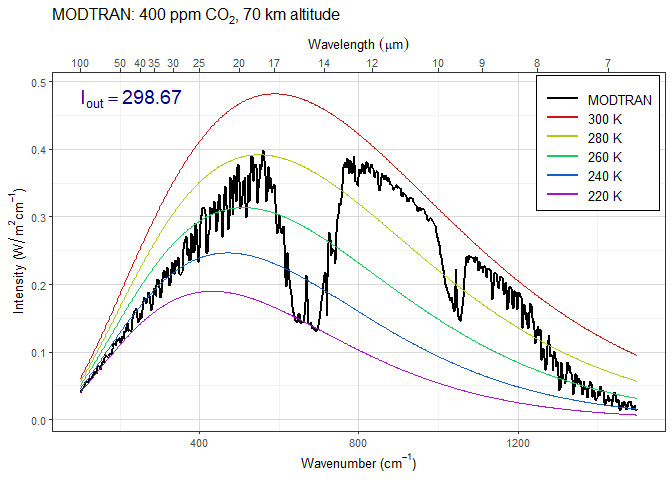
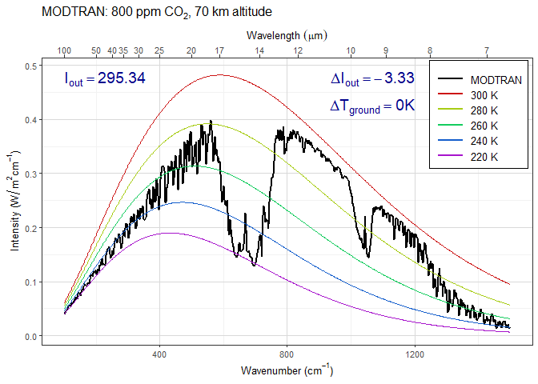
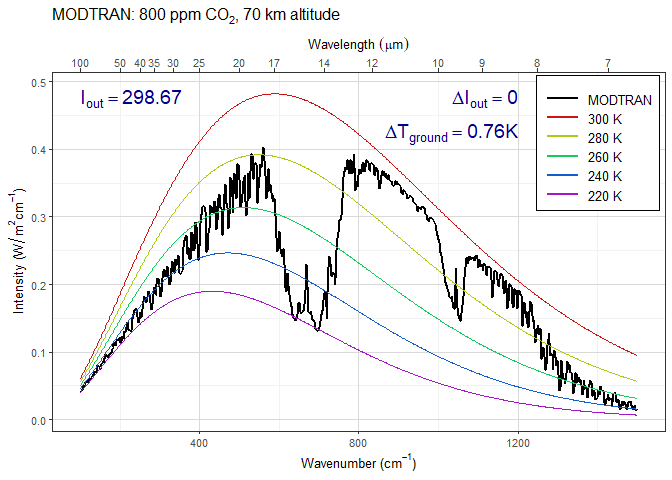
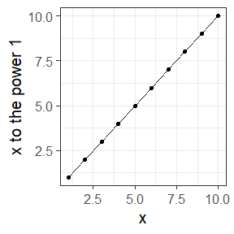
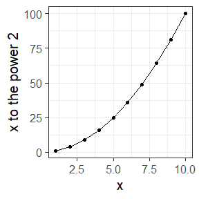
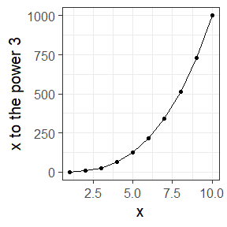
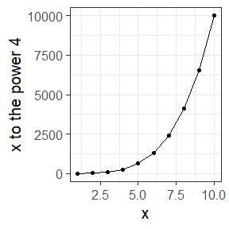
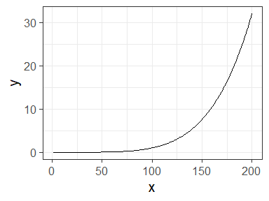

Instructions for EES 3310/5310 Lab #3
================
Jonathan Gilligan
Lab: Mon. Feb. 7. Due: Wed. Feb 16

-   [Instructions](#instructions)
    -   [Using MODTRAN with RMarkdown.](#using-modtran-with-rmarkdown)
        -   [Converting temperature
            units](#converting-temperature-units)
    -   [Examples:](#examples)
-   [A few new R functions that we will use in this
    lab:](#a-few-new-r-functions-that-we-will-use-in-this-lab)
    -   [Iterating over a series](#iterating-over-a-series)
    -   [Manipulating text in R](#manipulating-text-in-r)
    -   [Calculating with leads and
        lags](#calculating-with-leads-and-lags)
    -   [Modifying *x* and *y* axes in
        `ggplot`](#modifying-x-and-y-axes-in-ggplot)
-   [Exercises for Lab #3](#exercises-for-lab-3)
-   [Chapter 4 Exercises](#chapter-4-exercises)
    -   [Exercise 4.1: Methane](#exercise-41-methane)
    -   [Exercise 4.2: CO<sub>2</sub> (Graduate students
        only)](#exercise-42-co2-graduate-students-only)
    -   [Exercise 4.3: Water vapor](#exercise-43-water-vapor)
-   [Chapter 5 Exercise](#chapter-5-exercise)
    -   [Exercise 5.2: Skin Height](#exercise-52-skin-height)

# Instructions

It would be good to print these instructions and bring them to lab on
Monday, or else to have the PDF with the instructions handy during lab.

For these exercises, I recommend that you work on them with the
interactive web-based MODTRAN models to get a feel for how the models
apply to the exercise.

Once you are clear what you are doing, you can use the R scripts and
RMarkdown to turn those insights into reproducible research.

## Using MODTRAN with RMarkdown.

This RMarkdown document includes the line
`source("_scripts/modtran.R")`, which loads a script with the following
functions:

-   `run_modtran()` allows you to automatically download a file with the
    data from a MODTRAN run. You call it with the following arguments:

    -   `filename` is an optional name for a file to save the data to.
        If you don’t specify the `filename`, then `run_modtran` will not
        save the model output to the disk. I recommend giving it a
        meaningful name: for instance, a run with 550 ppm CO2 and 3.4
        ppm methane might be called “`modtran_440_34.txt`”. Make up your
        own file names, but think about how you will tell which is
        which. I also recommend that you save the files in the `_data`
        subdirectory to keep your project nicely organized.

    -   `co2_ppm` is the amount of CO<sub>2</sub> in parts per million.
        The default is 400.

    -   `ch4_ppm` is the amount of methane in parts per million. The
        default is 1.7.

    -   `trop_o3_ppb` is the amount of ozone in the troposphere, in
        parts per billion. The default is 28. You probably won’t change
        this unless you’re setting all greenhouse gases to zero.

    -   `strat_o3_scale` is the amount of stratospheric ozone, relative
        to the naturally occurring levels in the ozone layer. You
        probably won’t change this unless you’re setting all greenhouse
        gases to zero.

    -   `h2o_scale` is the amount of water vapor, relative to the
        naturally occurring levels in the atmosphere. You probably won’t
        change this unless you’re setting all greenhouse gases to zero.

    -   `freon_scale` is the amount of freon chemicals (used for
        refrigerators and air conditioners), relative to the current
        amounts. You probably won’t change this unless you’re setting
        all greenhouse gases to zero.

    -   `delta_t` is the temperature offset, in degrees C. You adjust
        this to restore radiative equilibrium after you change the
        amount of CO<sub>2</sub> or other greenhouse gases.

    -   `h2o_fixed` is what quantity to hold fixed for water vapor.
        Possible values are “vapor pressure” (the default), and
        “relative humidity”

    -   `atmosphere` is the locality in the MODTRAN model. Possible
        values are:

        -   `"tropical"` (the default),
        -   `"midlatitude summer"`,
        -   `"midlatitude winter"`,
        -   `"subarctic summer"`,
        -   `"subarctic winter"`,
        -   and `"standard"` for the 1976 U.S. standard atmosphere.

    -   `clouds` is the specification of clouds and rain. Possible
        values are

        -   `"none"` (the default),
        -   `"cumulus"`,
        -   `"altostratus"`,
        -   `"stratus"`,
        -   `"stratocumulus"`,
        -   `"nimbostratus"`,
        -   `"drizzle"`,
        -   `"light rain"`,
        -   `"medium rain"`,
        -   `"heavy rain"`,
        -   `"extreme rain"`,
        -   `"standard cirrus"`,
        -   `"subvisual cirrus"`,
        -   and `"NOAA cirrus"`.

        **Stratus clouds** are flat, opaque, and low-altitude.
        **Altostratus clouds** are flat and medium altitude. **Cirrus
        clouds** are thin and high-altitude. They are hard to model, so
        there are three different varieties. **Cumulus clouds** are
        thick and stretch from low altitudes to medium altitudes.
        **Stratocumulus clouds** are like thunder clouds. They are very
        tall and reach from low altitudes to the top of the troposphere.
        **Nimbostratus clouds** are low and thick, like stratus, but
        produce rain.

    -   `altitude_km` is the altitude, in kilometers above sea level,
        that you put your virtual sensor in the model. The default is 70
        km, which is above almost all of the atmosphere.

        For some exercises, you may experiment with putting the sensor
        somewhere around 8 to 12 km, which is the top of the
        troposphere, below the stratospheric ozone layer.

        For other exercises, you might want to put it at 0 km (ground
        level), and set it to look up instead of down, so you can see
        the IR radiation coming down to the ground from the atmosphere
        instead of looking at the IR radiation going out to space.

    -   `looking` is the direction the sensor is looking. The options
        are “down” (the default) or “up”.

    Any arguments you don’t specify explicitly take on their default
    value. Thus,
    `run_modtran(file.path(data_dir, "modtran_experiment_1.txt"), co2_ppm = 800, delta_t = 1.0, h2o_fixed = "relative humidity")`
    would run with all the default values, except for 800 ppm
    CO<sub>2</sub>, a temperature offset of 1°C, and holding relative
    humidity fixed.

    The function **returns a list with 7 elements**:

    -   `spectrum` is a data tibble with the spectral information
        (wavelength `lambda`, wavenumber `k`, outgoing IR intensity
        `tk`, and a number of other variables.)
    -   `profile` is the profile of the atmosphere: a tibble with seven
        columns:
        -   `Z` is the altitude in km,
        -   `P` is the atmospheric pressure, in millibars, and
        -   `T` is the temperature in Kelvin.
        -   `H2O` is the concentration of water vapor, in parts per
            million at each altitude.
        -   `O3` is the concentration of ozone, in parts per million at
            each altitude.
        -   `CO2` is the concentration of carbon dioxide, in parts per
            million at each altitude.
        -   `CH4` is the concentration of methane, in parts per million
            at each altitude.
    -   `co2` is the atmospheric CO<sub>2</sub> concentration
    -   `ch4` is the atmospheric methane concentration
    -   `i_out` is the intensity of the outgoing IR radiation flux.
    -   `t_ground` is the ground temperature (in Kelvin) used in the
        model run. (Remember that this is something you set when you run
        the model. MODTRAN cannot calculate the way ground temperature
        changes when you change greenhouse gases, clouds, or other
        characteristics of the atmosphere.)
    -   `t_tropo` is the temperature at the tropopause (in Kelvin).
    -   `h_tropo` is the height of the tropopause (in km).
    -   `alt` is the altitude of the virtual sensor.
    -   `sensor_direction` is the direction of the virtual sensor (“up”
        or “down”).

    You can assign the output of `run_modtran()` to a variable like
    this: `mod_data = run_modtran("my_modtran_file.txt", co2_ppm = 400)`
    and then you can pass the value of `mod_data` to the
    `plot_modtran()` function, as described below.

-   `read_modtran(filename)` allows you to read in a MODTRAN output file
    (saved to the disk by `run_modtran()`. It returns a list with the
    same elements as `run_modtran()`.

-   `plot_modtran` generates a plot of the radiative spectrum. There are
    many arguments, and I won’t explain them all here, but the important
    ones are:

    -   `modtran_data` is the data that would be returned by the
        `run_modtran()` function. If you want to plot

    -   `filename` is the MODTRAN output file with the data to use for
        the plot.

        You can also provide data directly to `plot_modtran` instead of
        reading in a file: Instead of writing
        `plot_modtran("my_modtran_file.txt", ...)`, you could write,
        `plot_modtran(modtran_data = mod_data, ...)`, where `mod_data`
        is the output of `run_modtran()` or `read_modtran()`.

    -   `descr` is an optional string to use for the title of the plot.
        If you don’t specify anything, the function will make a title
        that indicates the CO2 concentration and the altitude of the
        virtual sensor.

    -   `i_out_ref` is a reference value for the outgoing infrared. If
        you don’t specify it, it’s ignored, but if you specify it, then
        the plotting function adds an annotation to indicate the
        difference in outgoing IR between the current run being plotted
        and the reference value. Typically, you’d run a baseline run of
        MODTRAN with default parameters and then use the upward IR flux
        from that run as `i_out_ref` when you change the CO<sub>2</sub>
        concentration or other model parameters.

    -   `delta_t` is the temperature offset for this model run. If you
        specify it, the plotting function adds an annotation to indicate
        it.

    -   `text_size` allows you to adjust the size of the text used for
        axis labels and the plot title.

### Converting temperature units

-   Some handy functions for converting temperature measurements from
    one unit of measurement to another are:

    -   `ktof(T)` converts `T` from Kelvin to Fahrenheit.

    -   `ktoc(T)` converts `T` from Kelvin to Celsius.

    -   `ftok(T)` converts `T` from Fahrenheit to Kelvin.

    -   `ctok(T)` converts `T` from Celsius to Kelvin.

    -   `ctof(T)` converts `T` from Celsius to Fahrenheit.

    -   `ftoc(T)` converts `T` from Fahrenheit to Celsius.

But be aware that if you want to convert the *difference between two
temperatures*, you need to convert the temperatures and then take the
difference:

``` r
t1_k = 254 # Kelvin temperature
t2_k = 288 # Kelvin temperature
delta_t_k = t2_k - t1_k # Difference in temeprature, in Kelvin

delta_t_k
```

    ## [1] 34

``` r
t1_f = ktof(t1_k) # Fahrenheit temperatures
t2_f = ktof(t2_k)

t1_f
```

    ## [1] -2.47

``` r
t2_f
```

    ## [1] 58.73

``` r
delta_t_f = t2_f - t1_f # Difference in temperature, in Fahrenheit

delta_t_f
```

    ## [1] 61.2

``` r
# This will give the wrong answer for the 
# temperature difference in Fahrenheit!
ktof(delta_t_k)
```

    ## [1] -398.47

You see that 58.73 minus -2.47 is not -398.47.

-   Some variables that I have defined for you are:

    -   `sigma_sb` is the Stefan-Boltzmann constant.

    -   `solar_constant` is the Solar Constant (the intensity of
        sunlight at the top of the atmosphere, 1350.).

## Examples:

``` r
modtran_baseline = run_modtran(filename = 
                                 file.path(data_dir, "modtran_baseline.txt"))
```

You could also write this as

``` r
run_modtran(filename = file.path(data_dir, "modtran_baseline.txt"))
modtran_baseline = read_modtran(file.path(data_dir, "modtran_baseline.txt"))
```

Now you can extract the various values from modtran_baseline:

``` r
baseline_i_out <- modtran_baseline$i_out
baseline_t_trop <- modtran_baseline$t_trop
```

The baseline MODTRAN run has *I*<sub>out</sub> = 299. and
*T*<sub>tropopause</sub> = 190..

``` r
plot_modtran(modtran_baseline)
```

<!-- -->

Or you could write

``` r
plot_modtran(filename = file.path(data_dir, "modtran_baseline.txt"))
```

<!-- -->

``` r
double_co2 = run_modtran(filename = file.path(data_dir, "modtran_double_co2.txt"), 
            co2_ppm = 800)
plot_modtran(double_co2, i_out_ref = baseline_i_out, delta_t = 0)
```

<!-- -->

``` r
mod_file = file.path(data_dir, "modtran_double_co2_warming.txt")
double_co2_warming = run_modtran(filename = mod_file, 
                                 co2_ppm = 800, delta_t = 0.76)
plot_modtran(double_co2_warming, i_out_ref = baseline_i_out, delta_t = 0.76)
```

<!-- -->

# A few new R functions that we will use in this lab:

## Iterating over a series

Sometimes you want to repeat something in R, executing the same commands
for many different values of a variable. We can do this with the `for`
command:

``` r
df = tibble(x = 1:10)

for (i in 1:4) {
  p = ggplot(df, aes(x = x, y = x^i)) + 
    geom_point() + geom_line() +
    labs(x = "x", y = str_c("x to the power ", i))
  plot(p)
}
```

<!-- --><!-- --><!-- --><!-- -->

This gives us a nice way to run MODTRAN over and over, with many
different values for the CO<sub>2</sub> concentration and recording the
value of I<sub>out</sub> for each concentration.

In the loop below, we set all the greenhouse gases to zero and then vary
CO<sub>2</sub>. We use a trick in R by making an empty tibble before we
start the loop and then for each iteration of the loop, we use
`bind_rows` to append a row with the data from that loop iteration.

``` r
co2_values = c(0, 200, 400, 600, 800, 1000, 1200)
tbl = tibble()
for (co2 in co2_values) {
  filename = str_c("modtran_co2_", co2, ".txt")
  mod_data = run_modtran(filename, co2_ppm = co2, ch4_ppm = 0, trop_o3_ppb = 0,
                         strat_o3_scale = 0, h2o_scale = 0, freon_scale = 0,
                         atmosphere = "standard", altitude_km = 70)
  tbl = bind_rows(tbl, tibble(co2_ppm = co2, i_out = mod_data$i_out))
}

# The digits argument below sets the number of decimal places
# for each column in the table.
kable(tbl, digits = c(co2_ppm = 0, i_out = 1))
```

This code runs `run_modtran` for each value of CO<sub>2</sub> in
`co2_values` and saves the result to a file `modtran_0.txt`,
`modtran_200.txt`, and so forth. I make the filenames from the values of
`co2` using the `str_c` function, which I explain below.

## Manipulating text in R

R has many functions for manipulating text. When R stores text, it
stores it in character variables (these are also sometimes called
“strings” because text is like a string of characters). For instance, we
might want to make a label or a filename by combining several variables.
We can use the function `str_c`, from the `tidyverse`:

``` r
print(str_c("infra", "red"))
```

    ## [1] "infrared"

``` r
print(str_c("infra", "red", sep = "-"))
```

    ## [1] "infra-red"

``` r
print(str_c(10, "km", sep = " "))
```

    ## [1] "10 km"

``` r
print(str_c("one", "two", "three", "four", sep = ", "))
```

    ## [1] "one, two, three, four"

``` r
x = 50

print(str_c(x, "Watts"))
```

    ## [1] "50Watts"

``` r
print(str_c(x, " Watts"))
```

    ## [1] "50 Watts"

``` r
print(str_c(x, "Watts", sep = " "))
```

    ## [1] "50 Watts"

Notice how `str_c` pastes the text together without any spaces between
the parts unless you tell it to use a separator (`sep`) between them.

## Calculating with leads and lags

Sometimes, when we are using `mutate` with a data tibble, we might want
to look at differences between a row and the row before or after it in
the tibble. We can do this with the `lead` and `lag` functions:

In the example below, the column `u` gets the value of the current row
of `y` minus the previous row of `y`, and the column `v` gets the value
of the next row of `y` minus the current row of `y`. Note that where
there isn’t a previous row, `lag` returns `NA` (missing value), and
similarly for `lead` when there isn’t a next row.

``` r
tbl = tibble(x = 0:5, y = x^2)

tbl = tbl %>% mutate("lag y" = lag(y), "lead y" = lead(y), u = y - lag(y), 
                     v = lead(y) - y)
kable(tbl)
```

|   x |   y | lag y | lead y |   u |   v |
|----:|----:|------:|-------:|----:|----:|
|   0 |   0 |    NA |      1 |  NA |   1 |
|   1 |   1 |     0 |      4 |   1 |   3 |
|   2 |   4 |     1 |      9 |   3 |   5 |
|   3 |   9 |     4 |     16 |   5 |   7 |
|   4 |  16 |     9 |     25 |   7 |   9 |
|   5 |  25 |    16 |     NA |   9 |  NA |

If you want to lead or lag by more than one row, you can just say,
`lag(y, 5)` to get the value of `y` 5 rows before the current one.

``` r
tbl = tibble(x = 1:10)
tbl = tbl %>% mutate(before = lag(x), after = lead(x), 
                     before.2 = lag(x, 2), after.3 = lead(x, 3))
kable(tbl)
```

|   x | before | after | before.2 | after.3 |
|----:|-------:|------:|---------:|--------:|
|   1 |     NA |     2 |       NA |       4 |
|   2 |      1 |     3 |       NA |       5 |
|   3 |      2 |     4 |        1 |       6 |
|   4 |      3 |     5 |        2 |       7 |
|   5 |      4 |     6 |        3 |       8 |
|   6 |      5 |     7 |        4 |       9 |
|   7 |      6 |     8 |        5 |      10 |
|   8 |      7 |     9 |        6 |      NA |
|   9 |      8 |    10 |        7 |      NA |
|  10 |      9 |    NA |        8 |      NA |

## Modifying *x* and *y* axes in `ggplot`

It is easy to modify the *x* or *y* axis in `ggplot`. For instance, if
you want to put specific limits on the axis, or change where the labels
go, you can use `scale_x_continuous` or `scale_y_continuous`:

``` r
tbl = tibble(x = 1:200, y = (x / 100)^5)

ggplot(tbl, aes(x = x, y = y)) + geom_line()
```

<!-- -->

``` r
ggplot(tbl, aes(x = x, y = y)) + geom_line() +
  scale_x_continuous(limits = c(0,150), breaks = seq(0, 150, 25)) +
  scale_y_continuous(limits = c(0,10))
```

<!-- -->

``` r
tbl = tibble(x = 1:200, y = 5 - 2 * x + 3 * x^2)

# Note that in R when we are typing numbers, we can express scientific notation 
# as 1E6 for 1,000,000 2.67E-3 for 0.00267

ggplot(tbl, aes(x = x, y = y)) + geom_line() +
  scale_x_log10(limits = c(1,1000)) +
  scale_y_log10(limits = c(1,1E6))
```

<!-- -->

# Exercises for Lab #3

You should open the file `lab-03-report.Rmd` to do these exercises.

# Chapter 4 Exercises

## Exercise 4.1: Methane

Methane has a current concentration of 1.7 ppm in the atmosphere and is
doubling at a faster rate than CO<sub>2</sub>.

1.  **Would an additional 10 ppm of methane in the atmosphere have a
    larger or smaller impact on the outgoing IR flux than an additional
    10 ppm of CO<sub>2</sub> at current concentrations?**

    **Suggestion:**

    -   Run MODTRAN in the default configuration (400 ppm CO<sub>2</sub>
        and 1.7 ppm methane)
    -   Run MODTRAN with an extra 10 ppm of CO<sub>2</sub> and the
        normal amount of methane.
    -   Run MODTRAN with the normal amount of CO<sub>2</sub> and an
        extra 10 ppm of methane.

    What would you look at from the three runs to figure out whether 10
    ppm of methane or 10 ppm of CO<sub>2</sub> had the greater effect?

2.  **Where in the spectrum does methane absorb? What concentration does
    it take to begin to saturate the absorption in this band? Explain
    what you are looking at to judge when the gas is saturated.**

    **Hints**:  
    I recommend setting all the greenhouse gases to zero, and run
    MODTRAN. Then run MODTRAN for several values of methane, starting at
    1 ppm and doubling the concentration until you get to around 128
    ppm. You can do this using a `for` loop, following the examples from
    the lab instructions.

    To set all the greenhouse gases to zero, you would call
    `run_modtran(co2_ppm = 0, ch4_ppm = 0, trop_o3_ppb = 0, strat_o3_scale = 0, h2o_scale = 0, freon_scale = 0)`

    The spectrum of methane is complicated so it doesn’t saturate all at
    once. Use `plot_modtran` to plot the spectrum for each concentration
    and describe what you see and where you think methane begins to
    saturate and why.

    By default, `plot_modtran` gives a plot a title that indicates the
    CO<sub>2</sub> concentration. Here, CO<sub>2</sub> doesn’t change
    and we’re interested in the CH<sub>4</sub> concentration, so you can
    use the `descr` argument to `plot_modtran` to give the plots
    different titles. See the example below.

    Remember that if you want to make several plots using a `for` loop,
    you need to assign the result from `plot_modtran` or `ggplot` to a
    variable and then use the `plot` or `print` function.

    ``` r
    for (ch4 in ch4_list) {
      mod_data = run_modtran(co2_ppm = 0, ch4_ppm = ch4, trop_o3_ppb = 0,
      strat_o3_scale = 0, h2o_scale = 0, freon_scale = 0)
      p = plot_modtran(mod_data)
      plot(p) # you could also say print(p) here.
    }
    ```

    This will take some time to run because it needs to run MODTRAN for
    each different value of `ch4`, so you might want to tell R to save
    the output from the model in a file, and tell R to check whether
    that file exists and if it does, read from the file instead of
    running the model again:

    ``` r
    for (ch4 in ch4_list) {
      # make a name for the model-output file: "_data/modtran_ch4_0_ppm.txt",
      # "_data/modtran_ch4_1.7_ppm.txt", etc.
      mod_file = str_c("_data/modtran_ch4_", ch4, "_ppm.txt")
      if (! file.exists(mod_file)) {
        mod_data = run_modtran(filename = mod_file, co2_ppm = 0, ch4_ppm = ch4, 
                               trop_o3_ppb = 0, strat_o3_scale = 0, 
                               h2o_scale = 0, freon_scale = 0)
      } else {
        mod_data = read_modtran(mod_file)
      }
      p = plot_modtran(mod_data)
      plot(p) # you could also say print(p) here.
    }
    ```

    But if you do this, then if you change the way you run the model
    (e.g., change some of the parameters to `run_modtran`, such as the
    altitude or the atmosphere), you will need to manually delete the
    files in the `_data` directory to make R run the model with the new
    parameters.

3.  **Would a doubling of methane have as great an impact on the heat
    balance as a doubling of CO<sub>2</sub>?**

    **Suggestion:**

    -   Run MODTRAN in its default configuration (400 ppm CO<sub>2</sub>
        and 1.7 ppm methane)
    -   Run it again with double the methane concentration.
    -   Run it again with the default methane (1.7 ppm) but double the
        CO<sub>2</sub> concentration.
    -   Compare *I*<sub>out</sub> for the three runs.

4.  **What is the “equivalent CO<sub>2</sub>” of doubling atmospheric
    methane? That is to say, how many ppm of CO<sub>2</sub> would lead
    to the same change in outgoing IR radiation energy flux as doubling
    methane? What is the ratio of ppm CO<sub>2</sub> change to ppm
    methane change?**

## Exercise 4.2: CO<sub>2</sub> (Graduate students only)

1.  **Is the direct effect of increasing CO<sub>2</sub> on the energy
    output at the top of the atmosphere larger in high latitudes or in
    the tropics?**

    **Hint:** Run MODTRAN with the atmosphere set to `tropical`,
    `midlatitude summer`, and `subarctic summer`, and for each
    atmosphere, at 400 ppm and 800 ppm CO<sub>2</sub>. For each
    atmosphere, calculate the difference between I<sub>out</sub> at 400
    and 800 ppm CO<sub>2</sub> and determine how the effect of doubling
    CO<sub>2</sub> varies as you go from tropical latitudes to subarctic
    ones.

2.  **Set pCO<sub>2</sub> to an absurdly high value of 10,000 ppm. You
    will see a spike in the CO<sub>2</sub> absorption band. What
    temperature is this light coming from? Where in the atmosphere do
    you think this comes from?**

    **Now turn on clouds and run the model again. Explain what you see.
    Why are night-time temperatures warmer when there are clouds?**

    **Hint:** MODTRAN simulates the upward directed, outgoing longwave
    radiation as seen by a sensor looking down from some height. For the
    first part of this exercise, start with the sensor at its default
    altitude of 70 km (you set this with the `altitude_km` argument to
    `run_modtran`), and successively lower it by 10 km at a time until
    you get to 10 km. What happens to the spike as you lower the sensor?
    What does this say about what part of the atmosphere is responsible
    for the spike in the middle of the CO<sub>2</sub> absorption at very
    high values of CO<sub>2</sub>?

    For the second part of this exercise, try using “altostratus”
    clouds.

## Exercise 4.3: Water vapor

Our theory of climate presumes that an increase in the temperature at
ground level will lead to an increase in the outgoing IR energy flux at
the top of the atmosphere.

1.  **How much extra outgoing IR would you get by raising the
    temperature of the ground by 5°C? What effect does the ground
    temperature have on the shape of the outgoing IR spectrum and why?**

    **HINT**: You can raise the temperature of the ground with the
    `delta_t` artument to MODTRAN.

2.  **More water can evaporate into warm air than into cool air. Change
    the model settings to hold the water vapor at constant relative
    humidity rather than constant vapor pressure (the default),
    calculate the change in outgoing IR energy flux for a 5°C
    temperature increase. Is it higher or lower? Does water vapor make
    the Earth more sensitive to CO<sub>2</sub> increases or less
    sensitive?**

    **Note:** By default, the MODTRAM model holds water vapor pressure
    constant, but you can set it to hold relative humidity constant
    instead with the option `h2o_fixed = "relative humidity"`, like
    this:
    `run_modtran(file_name, delta_t = 5, h2o_fixed = "relative humidity")`.

3.  **Now see this effect in another way.**

    -   **Starting from the default base case, record the total outgoing
        IR flux.**

    -   **Now double CO<sub>2</sub>. The temperature in the model stays
        the same (that’s how the model is written), but the outgoing IR
        flux goes down.**

    -   **Using constant water vapor pressure, adjust the temperature
        offset until you get the original IR flux back again. Record the
        change in temperature.**

    -   **Now repeat the exercise, but holding the relative humidity
        fixed instead of the water vapor pressure.**

    -   **The ratio of the warming when you hold relative humidity fixed
        to the warming when you hold water vapor pressure fixed is the
        feedback factor for water vapor. What is it?**

# Chapter 5 Exercise

## Exercise 5.2: Skin Height

1.  **Run the MODTRAN model using the “tropical” atmosphere, without
    clouds, and with the present-day CO<sub>2</sub> concentration (400
    ppm). Use the ground temperature reported by the model to calculate
    *ε**σ**T*<sub>ground</sub><sup>4</sup>, the heat flux emitted by the
    ground. Assume *ε* = 1, and I have already provided the value of the
    Stefan-Boltzmann constant *σ*, as the R variable `sigma_sb`, which
    equals 5.670×10<sup>-8</sup>. (I defined it in the script “utils.R”,
    which I loaded in the “setup” chunk in the RMarkdown document).**

    **Next, look at the outgoing heat flux at the top of the atmosphere
    (70 km) (I<sub>out</sub>) reported by the MODTRAN model. Is it
    greater or less than the heat flux that you calculated was emitted
    by the ground?**

2.  **Use the outgoing heat flux at the top of the atmosphere
    (I<sub>out</sub>) to calculate the skin temperature (use the
    equation *I*<sub>out</sub> = *ε**σ**T*<sub>skin</sub><sup>4</sup>)).
    What is the skin temperature, and how does it compare to the ground
    temperature and the temperature at the tropopause, as reported by
    the MODTRAN model (`t_tropo`)?**

    **Assuming an environmental lapse rate of 6K/km, and using the skin
    temperature that you calculated above, and the ground temperature
    from the model, what altitude would you expect the skin height to
    be?**

3.  **Double the CO<sub>2</sub> concentration and run MODTRAN again. Do
    not adjust the ground temperature. Repeat the calculations from (b)
    of the skin temperature and the estimated skin height.**

    **What is the new skin temperature? What is the new skin height?**

4.  **Put the CO<sub>2</sub> back to today’s value, but add cirrus
    clouds, using the “standard cirrus” value for the clouds. Repeat the
    calculations from (b) of the skin temperature and the skin height.**

    **What is the new skin temperature? What is the new skin height? Did
    the clouds or the doubled CO<sub>2</sub> have a greater effect on
    the skin height?**
