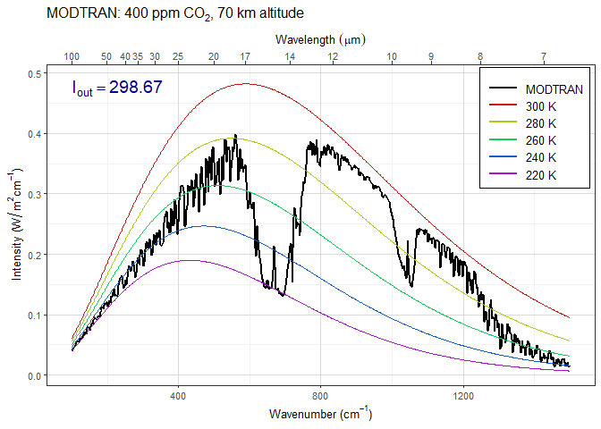
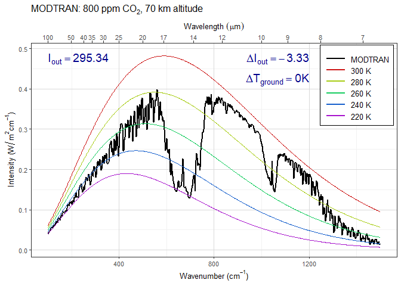
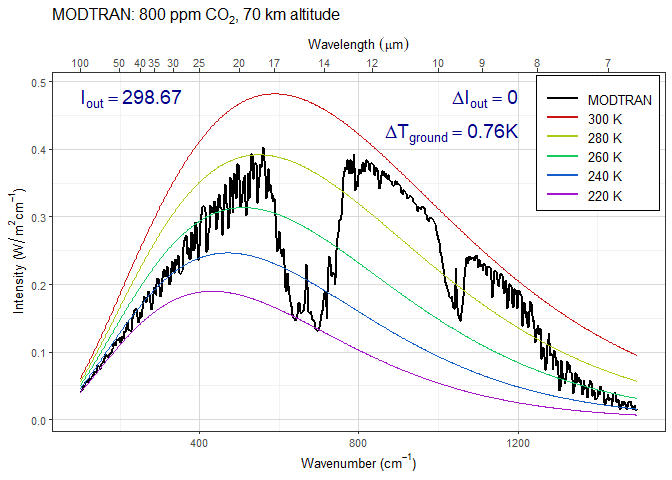
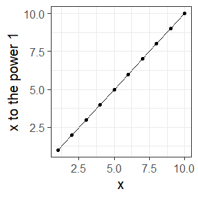
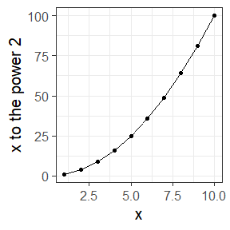
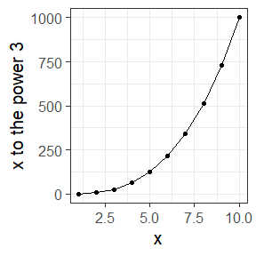
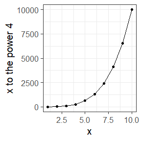
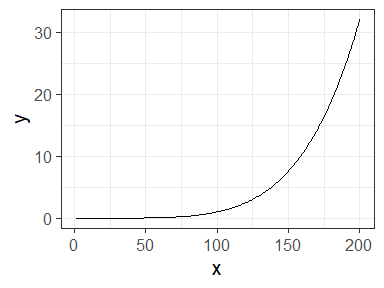
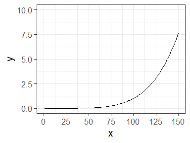

Instructions for EES 3310/5310 Lab \#3
================
Jonathan Gilligan
Lab: Mon. Jan. 10. Due: Mon. Feb. 3

  - [Instructions](#instructions)
      - [Using MODTRAN with RMarkdown.](#using-modtran-with-rmarkdown.)
          - [Converting temperature
            units](#converting-temperature-units)
      - [Examples:](#examples)
  - [A few new R functions that we will use in this
    lab:](#a-few-new-r-functions-that-we-will-use-in-this-lab)
      - [Iterating over a series](#iterating-over-a-series)
      - [Combining character variables](#combining-character-variables)
      - [Calculating with leads and
        lags](#calculating-with-leads-and-lags)
      - [Modifying *x* and *y* axes in
        `ggplot`](#modifying-x-and-y-axes-in-ggplot)
  - [Exercises for Lab \#3](#exercises-for-lab-3)
      - [Chapter 4 Exercises](#chapter-4-exercises)
          - [Exercise 4.1: Methane](#exercise-4.1-methane)
          - [Exercise 4.2: CO<sub>2</sub> (Graduate students
            only)](#exercise-4.2-co2-graduate-students-only)
          - [Exercise 4.3: Water vapor](#exercise-4.3-water-vapor)
      - [Chapter 5 Exercise](#chapter-5-exercise)
          - [Exercise 5.2: Skin Height](#exercise-5.2-skin-height)

# Instructions

It would be good to print these instructions and bring them to lab on
Monday, or else to have the PDF with the instructions handy during lab.

For these exercises, I recommend that you work on them with the
interactive web-based MODTRAN models to get a feel for how the models
apply to the exercise.

Once you are clear what you are doing, you can use the R scripts and
RMarkdown to turn those insights into reproducible research.

## Using MODTRAN with RMarkdown.

This RMarkdown document includes the line `source("scripts/modtran.R")`,
which loads a script with the following functions:

  - `run_modtran()` allows you to automatically download a file with the
    data from a MODTRAN run. You call it with the following arguments:
    
      - `filename` is the name of the file to save the data to. I
        recommend giving it a meaningful name: for instance, a run with
        550 ppm CO2 and 3.4 ppm methane might be called
        “`modtran_440_34.txt`”. Make up your own file names, but think
        about how you will tell which is which.
    
      - `co2_ppm` is the amount of CO<sub>2</sub> in parts per million.
        The default is 400.
    
      - `ch4_ppm` is the amount of methane in parts per million. The
        default is 1.7.
    
      - `trop_o3_ppb` is the amount of ozone in the troposphere, in
        parts per billion. The default is 28. You probably won’t change
        this unless you’re setting all greenhouse gases to zero.
    
      - `strat_o3_scale` is the amount of stratospheric ozone, relative
        to the naturally occurring levels in the ozone layer. You
        probably won’t change this unless you’re setting all greenhouse
        gases to zero.
    
      - `h2o_scale` is the amount of water vapor, relative to the
        naturally occurring levels in the atmosphere. You probably won’t
        change this unless you’re setting all greenhouse gases to zero.
    
      - `freon_scale` is the amount of freon chemicals (used for
        refrigerators and air conditioners), relative to the current
        amounts. You probably won’t change this unless you’re setting
        all greenhouse gases to zero.
    
      - `delta_t` is the temperature offset, in degrees C. You adjust
        this to restore radiative equilibrium after you change the
        amount of CO<sub>2</sub> or other greenhouse gases.
    
      - `h2o_fixed` is what quantity to hold fixed for water vapor.
        Possible values are “vapor pressure” (the default), and
        “relative humidity”
    
      - `atmosphere` is the locality in the MODTRAN model. Possible
        values are:
        
          - `"tropical"` (the default),
          - `"midlatitude summer"`,
          - `"midlatitude winter"`,
          - `"subarctic summer"`,
          - `"subarctic winter"`,
          - and `"standard"` for the 1976 U.S. standard atmosphere.
    
      - `clouds` is the specification of clouds and rain. Possible
        values are
        
          - `"none"` (the default),
          - `"cumulus"`,
          - `"altostratus"`,
          - `"stratus"`,
          - `"stratocumulus"`,
          - `"nimbostratus"`,
          - `"drizzle"`,
          - `"light rain"`,
          - `"medium rain"`,
          - `"heavy rain"`,
          - `"extreme rain"`,
          - `"standard cirrus"`,
          - `"subvisual cirrus"`,
          - and `"NOAA cirrus"`.
        
        **Stratus clouds** are flat, opaque, and low-altitude.
        **Altostratus clouds** are flat and medium altitude. **Cirrus
        clouds** are thin and high-altitude. They are hard to model, so
        there are three different varieties. **Cumulus clouds** are
        thick and stretch from low altitudes to medium altitudes.
        **Stratocumulus clouds** are like thunder clouds. They are very
        tall and reach from low altitudes to the top of the troposphere.
        **Nimbostratus clouds** are low and thick, like stratus, but
        produce rain.
    
      - `altitude_km` is the altitude, in kilometers above sea level,
        that you put your virtual sensor in the model. The default is 70
        km, which is above almost all of the atmosphere.
        
        For some exercises, you may experiment with putting the sensor
        somewhere around 8 to 12 km, which is the top of the
        troposphere, below the stratospheric ozone layer.
        
        For other exercises, you might want to put it at 0 km (ground
        level), and set it to look up instead of down, so you can see
        the IR radiation coming down to the ground from the atmosphere
        instead of looking at the IR radiation going out to space.
    
      - `looking` is the direction the sensor is looking. The options
        are “down” (the default) or “up”.
    
    Any arguments you don’t specify explicitly take on their default
    value. Thus, `run_modtran(file.path(data_dir,
    "modtran_experiment_1.txt"), co2_ppm = 800, delta_t = 1.0, h2o_fixed
    = "relative humidity")` would run with all the default values,
    except for 800 ppm CO<sub>2</sub>, a temperature offset of 1°C, and
    holding relative humidity fixed.
    
    You can assign the output of `run_modtran()` to a variable like
    this: `mod_data <- run_modtran("my_modtran_file.txt", co2_ppm
    = 400)` and then you can pass the value of `mod_data` to the
    `plot_modtran()` function, as described below.

  - `plot_modtran` reads a MODTRAN output file and generates a plot.
    There are many arguments, and I won’t explain them all here, but the
    important ones are:
    
      - `filename` is the MODTRAN output file with the data to use for
        the plot.
        
        You can also provide data directly to `plot_modtran` instead of
        reading in a file: Instead of writing
        `plot_modtran("my_modtran_file.txt", ...)`, you could write,
        `plot_modtran(modtran_data = mod_data, ...)`, where `mod_data`
        is the output of `run_modtran()` or `read_modtran()`.
    
      - `descr` is an optional string to use for the title of the plot.
        If you don’t specify anything, the function will make a title
        that indicates the CO2 concentration and the altitude of the
        virtual sensor.
    
      - `i_out_ref` is a reference value for the outgoing infrared. If
        you don’t specify it, it’s ignored, but if you specify it, then
        the plotting function adds an annotation to indicate the
        difference in outgoing IR between the current run being plotted
        and the reference value. Typically, you’d run a baseline run of
        MODTRAN with default parameters and then use the upward IR flux
        from that run as `i_out_ref` when you change the CO<sub>2</sub>
        concentration or other model parameters.
    
      - `delta_t` is the temperature offset for this model run. If you
        specify it, the plotting function adds an annotation to indicate
        it.
    
      - `text_size` allows you to adjust the size of the text used for
        axis labels and the plot title.

  - `read_modtran(filename)` allows you to read in a MODTRAN output file
    and examine the data. This function returns a list with 7 elements:
    
      - `spectrum` is a data tibble with the spectral information
        (wavelength `lambda`, wavenumber `k`, outgoing IR intensity
        `tk`, and a number of other variables.)
    
      - `profile` is the profile of the atmosphere: a tibble with seven
        columns:
        
          - `Z` is the altitude in km,
          - `P` is the atmospheric pressure, in millibars, and
          - `T` is the temperature in Kelvin.
          - `H2O` is the concentration of water vapor, in parts per
            million at each altitude.
          - `O3` is the concentration of ozone, in parts per million at
            each altitude.
          - `CO2` is the concentration of carbon dioxide, in parts per
            million at each altitude.
          - `CH4` is the concentration of methane, in parts per million
            at each altitude.
    
      - `co2` is the atmospheric CO<sub>2</sub> concentration
    
      - `ch4` is the atmospheric methane concentration
    
      - `i_out` is the intensity of the outgoing IR radiation flux.
    
      - `t_ground` is the ground temperature (in Kelvin) used in the
        model run. (Remember that this is something you set when you run
        the model. MODTRAN cannot calculate the way ground temperature
        changes when you change greenhouse gases, clouds, or other
        characteristics of the atmosphere.)
    
      - `t_tropo` is the temperature at the tropopause (in Kelvin).
    
      - `h_tropo` is the height of the tropopause (in km).
    
      - `alt` is the altitude of the virtual sensor.
    
      - `sensor_direction` is the direction of the virtual sensor (“up”
        or “down”).

### Converting temperature units

  - Some handy functions for converting temperature measurements from
    one unit of measurement to another are:
    
      - `ktof(T)` converts `T` from Kelvin to Fahrenheit.
    
      - `ktoc(T)` converts `T` from Kelvin to Celsius.
    
      - `ftok(T)` converts `T` from Fahrenheit to Kelvin.
    
      - `ctok(T)` converts `T` from Celsius to Kelvin.
    
      - `ctof(T)` converts `T` from Celsius to Fahrenheit.
    
      - `ftoc(T)` converts `T` from Fahrenheit to Celsius.

But be aware that if you want to convert the *difference between two
temperatures*, you need to convert the temperatures and then take the
difference:

``` r
t1_k = 254 # Kelvin temperature
t2_k = 288 # Kelvin temperature
delta_t_k = t2_k - t1_k # Difference in temeprature, in Kelvin

delta_t_k
```

    ## [1] 34

``` r
t1_f = ktof(t1_k) # Fahrenheit temperatures
t2_f = ktof(t2_k)

t1_f
```

    ## [1] -2.47

``` r
t2_f
```

    ## [1] 58.73

``` r
delta_t_f = t2_f - t1_f # Difference in temperature, in Fahrenheit

delta_t_f
```

    ## [1] 61.2

``` r
# This will give the wrong answer for the 
# temperature difference in Fahrenheit!
ktof(delta_t_k)
```

    ## [1] -398.47

You see that 58.73 minus -2.47 is not -398.47.

  - Some variables that I have defined for you are:
    
      - `sigma_sb` is the Stefan-Boltzmann constant.
    
      - `solar_constant` is the Solar Constant (the intensity of
        sunlight at the top of the atmosphere).

## Examples:

``` r
run_modtran(filename = file.path(data_dir, "modtran_baseline.txt"))
modtran_baseline = read_modtran(file.path(data_dir, "modtran_baseline.txt"))
```

You could also write this as

``` r
modtran_baseline = run_modtran(filename = file.path(data_dir, "modtran_baseline.txt"))
```

Now you can extract the various values from modtran\_baseline:

``` r
baseline_i_out <- modtran_baseline$i_out
baseline_t_trop <- modtran_baseline$t_trop
```

The baseline MODTRAN run has \(I_{\text{out}} = 299.\) and
\(T_{\text{tropopause}} = 190.\).

``` r
plot_modtran(file.path(data_dir, "modtran_baseline.txt"))
```

<!-- -->

Or you could write

``` r
plot_modtran(modtran_data = modtran_baseline)
```

<!-- -->

``` r
double_co2 = run_modtran(filename = file.path(data_dir, "modtran_double_co2.txt"), 
            co2_ppm = 800)
plot_modtran(double_co2, i_out_ref = baseline_i_out, delta_t = 0)
```

<!-- -->

``` r
mod_file = file.path(data_dir, "modtran_double_co2_warming.txt")
double_co2_warming = run_modtran(filename = mod_file, 
                                 co2_ppm = 800, delta_t = 0.76)
plot_modtran(double_co2_warming, i_out_ref = baseline_i_out, delta_t = 0.76)
```

<!-- -->

# A few new R functions that we will use in this lab:

## Iterating over a series

Sometimes you want to repeat something in R, executing the same commands
for many different values of a variable. We can do this with the `for`
command:

``` r
df = tibble(x = 1:10)

for (i in 1:4) {
  p = ggplot(df, aes(x = x, y = x^i)) + 
    geom_point() + geom_line() +
    labs(x = "x", y = str_c("x to the power ", i))
  plot(p)
}
```

<!-- --><!-- --><!-- --><!-- -->

This gives us a nice way to run MODTRAN over and over, with many
different values for the CO<sub>2</sub> concentration:

``` r
co2_values = c(0, 200, 400, 600, 800, 1000, 1200)
for (co2 in co2_values) {
  filename = str_c("modtran_", co2, ".txt")
  run_modtran(filename, co2_ppm = co2, atmosphere = "standard", 
              altitude_km = 70)
}
```

This code runs `run_modtran` for each value of CO<sub>2</sub> in
`co2_values` and saves the result to a file `modtran_0.txt`,
`modtran_200.txt`, and so forth. I make the filenames from the values of
`co2` using the `str_c` function, which I explain below.

## Combining character variables

R has many functions for manipulating text. When R stores text, it
stores it in character variables (these are also sometimes called
“strings” because text is like a string of characters). For instance,
we might want to make a label or a filename by combining several
variables. Three functions that we can use are `str_c`, from the
`stringr` package and `paste` and `paste0`, from basic R. All of these
work pretty much the same way:

``` r
print(paste("mail", "box"))
```

    ## [1] "mail box"

``` r
print(paste("mail", "box", sep = ""))
```

    ## [1] "mailbox"

``` r
print(paste0("infra", "red"))
```

    ## [1] "infrared"

``` r
print(str_c("infra", "red"))
```

    ## [1] "infrared"

``` r
print(str_c("infra", "red", sep = "-"))
```

    ## [1] "infra-red"

``` r
print(str_c("one", "two", "three", "four", sep = ", "))
```

    ## [1] "one, two, three, four"

``` r
print(str_c(10, " km"))
```

    ## [1] "10 km"

``` r
x = 50

print(str_c(x, " Watts"))
```

    ## [1] "50 Watts"

``` r
print(str_c(x, "Watts", sep = " "))
```

    ## [1] "50 Watts"

Notice how `paste` puts spaces between the strings when it combines them
unless you specify that `sep` (the separator) should be something
different. `paste0` works just like `paste`, except that it doesn’t have
a separator, so the variables are combined without an extra space.
`str_c` is like `paste0`, except that you can specify a separator if you
do want something in between the different variables.

## Calculating with leads and lags

Sometimes, when we are using `mutate` with a data tibble, we might want
to look at differences between a row and the row before or after it in
the tibble. We can do this with the `lead` and `lag` functions:

In the examnple below, the column `u` gets the value of the current row
of `y` minus the previous row of `y`, and the column `v` gets the value
of the next row of `y` minus the current row of `y`. Note that where
there isn’t a previous row, `lag` returns `NA` (missing value), and
similarly for `lead` when there isn’t a next row.

``` r
tbl = tibble(x = 0:5, y = x^2)

tbl = tbl %>% mutate(u = y - lag(y), v = lead(y) - y)
tbl
```

    ## # A tibble: 6 x 4
    ##       x     y     u     v
    ##   <int> <dbl> <dbl> <dbl>
    ## 1     0     0    NA     1
    ## 2     1     1     1     3
    ## 3     2     4     3     5
    ## 4     3     9     5     7
    ## 5     4    16     7     9
    ## 6     5    25     9    NA

If you want to lead or lag by more than one row, you can just say,
`lag(y, 5)` to get the value of `y` 5 rows before the current one.

``` r
tbl = tibble(x = 1:10)

tbl = tbl %>% mutate(before = lag(x), after = lead(x), 
                     before.2 = lag(x, 2), after.3 = lead(x, 3))

tbl
```

    ## # A tibble: 10 x 5
    ##        x before after before.2 after.3
    ##    <int>  <int> <int>    <int>   <int>
    ##  1     1     NA     2       NA       4
    ##  2     2      1     3       NA       5
    ##  3     3      2     4        1       6
    ##  4     4      3     5        2       7
    ##  5     5      4     6        3       8
    ##  6     6      5     7        4       9
    ##  7     7      6     8        5      10
    ##  8     8      7     9        6      NA
    ##  9     9      8    10        7      NA
    ## 10    10      9    NA        8      NA

## Modifying *x* and *y* axes in `ggplot`

It is easy to modify the *x* or *y* axis in `ggplot`. For instance, if
you want to put specific limits on the axis, or change where the labels
go, you can use `scale_x_continuous` or `scale_y_continuous`:

``` r
tbl = tibble(x = 1:200, y = (x / 100)^5)

ggplot(tbl, aes(x = x, y = y)) + geom_line()
```

<!-- -->

``` r
ggplot(tbl, aes(x = x, y = y)) + geom_line() +
  scale_x_continuous(limits = c(0,150), breaks = seq(0, 150, 25)) +
  scale_y_continuous(limits = c(0,10))
```

<!-- -->

``` r
tbl = tibble(x = 1:200, y = 5 - 2 * x + 3 * x^2)

# Note that in R when we are typing numbers, we can express scientific notation 
# as 1E6 for 1,000,000 2.67E-3 for 0.00267

ggplot(tbl, aes(x = x, y = y)) + geom_line() +
  scale_x_log10(limits = c(1,1000)) +
  scale_y_log10(limits = c(1,1E6))
```

<!-- -->

# Exercises for Lab \#3

## Chapter 4 Exercises

### Exercise 4.1: Methane

Methane has a current concentration of 1.7 ppm in the atmosphere and is
doubling at a faster rate than CO<sub>2</sub>.

1)  Would an additional 10 ppm of methane in the atmosphere have a
    larger or smaller impact on the outgoing IR flux than an additional
    10 ppm of CO<sub>2</sub> at current concentrations?

2)  Where in the spectrum does methane absorb? What concentration does
    it take to begin to saturate the absorption in this band? Explain
    what you are looking at to judge when the gas is saturated.

**Suggestion:**

  - Run MODTRAN with no greenhouse gases, except 0.4 ppm of methane.

  - Run MODTRAN several times, successively doubling the amount of
    methane: 0.4 ppm, 0.8 ppm, 1.6 ppm, … 102.4 ppm.
    
    Hint: You can use the following R commands to do this:
    
        methane_data = tibble() # create a blank data tibble
        
        for (x in 0:11) {
          # Repeat everything between the braces "{}" for x taking on
          # each value in 0, 1, 2, ..., 11.
        
          p_methane = 0.4 * (2^x) # methane concentration is 0.4 times 2 to the 
                                  # power of x.
        
          # Create a character variable that will be a file name of the form
          # file.path(data_dir, "methane_xx_x.txt"), where xx_x is the methane 
          # concentration, with an underscore for the decimal point.
          methane_txt = formatC(p_methane, digits = 1, decimal.mark = "_", 
                                format = "f")
          file_name = str_c('methane_', methane_txt, ".txt")
          file_name = file.path(data_dir, filename)
        
          # Now run MODTRAN
          results = run_modtran(file_name, co2_ppm = 0, ch4_ppm = p_methane, 
                                trop_o3_ppb = 0, strat_o3_scale = 0, h2o_scale = 0, 
                                freon_scale = 0, 
                                delta_t = 0, h2o_fixed = "vapor pressure",
                                atmosphere = "tropical", clouds = "none", 
                                altitude_km = 70, looking = "down")
        
          # Create a data tibble with columns for the methane concentration
          # and I out, and append it to the end of the tibble methane_data
          df = tibble(methane = results$ch4, i_out = results$i_out)
          methane_data = bind_rows(methane_data, df)
          }
    
    This will run MODTRAN for the different values of methane
    concentration and save them in the `"_data"` folder as
    `"methane_0_4.txt"`, `"methane_0_8.txt"`, `"methane_1_6.txt"`, and
    so forth, up to `"methane_819_2.txt"`, and also create a data tibble
    `methane_data` with a list of methane concentrations and the
    corresponding \(I_{\text{out}}\).

  - Use `mutate` to add a new column `change`, which contains the change
    in \(I_{\text{out}}\) between the previous row and this one. You can
    use the `lag` command to calculate this, as described above in the
    “new R functions” section.
    
        methane_data = methane_data %>% mutate(change = i_out - lag(i_out))

  - Now plot `i_out` versus the methane concentration several ways:
    
      - First, just plot `i_out` versus `methane`:
        
            ggplot(methane_data, aes(x = methane, y = i_out)) + 
              geom_point(size = 2) +
              geom_line(size = 1) +
              labs() # add parameters to labs to label your axes.
    
      - Next, plot the same data, but with a logarithmic *x*-axis (use
        `scale_x_log10`, as described above in the “New R Functions”
        section)
    
      - Next, plot `methane_concentration`, but assign the column
        `change` to the *y* axis, instead of the column `i_out`.
    
      - Think back to the slides I showed in class \#6 about identifying
        band saturation. Do you see a place where the successive changes
        in `i_out` flatten out? Estimate the concentration of methane
        where absorption saturates.

<!-- end list -->

3)  Would a doubling of methane have as great an impact on the heat
    balance as a doubling of CO<sub>2</sub>?
    
    **Suggestion:**
    
      - Run MODTRAN in its default configuration (400 ppm CO<sub>2</sub>
        and 1.7 ppm methane)
      - Run it again with 10 ppm of extra methane
      - Run it again with the default methane (1.7 ppm) but 10 ppm extra
        CO<sub>2</sub>.
      - Compare \(I_{\text{out}}\) for the three runs.

4)  What is the “equivalent CO<sub>2</sub>” of doubling atmospheric
    methane? That is to say, how many ppm of CO<sub>2</sub> would lead
    to the same change in outgoing IR radiation energy flux as doubling
    methane? What is the ratio of ppm CO<sub>2</sub> change to ppm
    methane change?
    
    **Suggestion:** This is easier to do interactively with the
    web-based interface to MODTRAN than by running it in R.
    
      - Run MODTRAN in its default configuration (400 ppm CO<sub>2</sub>
        and 1.7 ppm methane)
      - Run MODTRAN again with the methane doubled. Note
        \(I_{\text{out}}\).
      - Return methane to the default value (1.7 ppm), and adjust
        CO<sub>2</sub> until \(I_{\text{out}}\) is the same as it was
        for the doubled methane. Note what concentration of
        CO<sub>2</sub> does this.
      - Now you can use R to run MODTRAN with doubled methane and with
        the equivalent concentration of CO<sub>2</sub>, and save these
        runs to the disk.

### Exercise 4.2: CO<sub>2</sub> (Graduate students only)

1)  Is the direct effect of increasing CO<sub>2</sub> on the energy
    output at the top of the atmosphere larger in high latitudes or in
    the tropics? Compare the change in \(I_{\text{out}}\) from doubling
    CO<sub>2</sub> with the atmosphere set to `tropical`, `midlatitude
    summer`, and `subartcic summer`.
    
    For each atmosphere, first record \(I_{\text{out}}\) with
    CO<sub>2</sub> at 400 ppm and then record the change when you
    increase CO<sub>2</sub> to 800 ppm.

2)  Set pCO<sub>2</sub> to an absurdly high value of 10,000 ppm. You
    will see a spike in the CO<sub>2</sub> absorption band. What
    temperature is this light coming from? Where in the atmosphere do
    you think this comes from?
    
    Now turn on clouds and run the model again. Explain what you see.
    Why are night-time temperatures warmer when there are clouds?

### Exercise 4.3: Water vapor

Our theory of climate presumes that an increase in the temperature at
ground level will lead to an increase in the outgoing IR energy flux at
the top of the atmosphere.

1)  How much extra outgoing IR would you get by raising the temperature
    of the ground by 5°C? What effect does the ground temperature have
    on the shape of the outgoing IR spectrum and why?
    
      - Note the \(I_{\text{out}}\) for the default conditions. Then set
        `delta_t` to 5 and run MODTRAN again, and note the new value of
        \(I_{\text{out}}\).
    
      - Plot the spectrum for both runs and compare.

2)  More water can evaporate into warm air than into cool air. Change
    the model settings to hold the water vapor at constant relative
    humidity rather than constant vapor pressure (the default),
    calculate the change in outgoing IR energy flux for a 5°C
    temperature increase. Is it higher or lower? Does water vapor make
    the Earth more sensitive to CO<sub>2</sub> increases or less
    sensitive?

3)  Now see this effect in another way.
    
      - Starting from the default base case, record the total outgoing
        IR flux.
    
      - Now double pCO2. The temperature in the model stays the same
        (that’s how the model is written), but the outgoing IR flux goes
        down.
    
      - Using constant water vapor pressure, adjust the temperature
        offset until you get the original IR flux back again. Record the
        change in temperature
    
      - Now repeat the exercise, but holding the relative humidity fixed
        instead of the water vapor pressure.
    
      - The ratio of the warming when you hold relative humidity fixed
        to the warming when you hold water vapor pressure fixed is the
        feedback factor for water vapor. What is it?

## Chapter 5 Exercise

### Exercise 5.2: Skin Height

1)  Run the MODTRAN model in using the “Tropical” atmosphere, without
    clouds, and with present-day pCO<sub>2</sub> (400 ppm). Use the
    ground temperature reported by the model to calculate
    \(\varepsilon \sigma T_{\text{ground}}^4\), the heat flux emitted by
    the ground.
    
    Assume \(\varepsilon = 1\), and I have already provided the value of
    the Stefan-Boltzmann constant \(\sigma\), as the R variable
    `sigma_sb`, which equals 5.670×10<sup>-8</sup>. (I defined it in the
    script “utils.R”, which I loaded in the “setup” chunk in the
    RMarkdown document).
    
    Next, look at the outgoing heat flux at the top of the atmosphere
    (70 km) reported by the MODTRAN model. Is it greater or less than
    the heat flux that you calculated was emitted by the ground?

2)  Use the outgoing heat flux at the top of the atmosphere to calcuate
    the skin temperature (use the equation
    \(I_{\text{out}} = \varepsilon \sigma T_{\text{skin}}^4\)). What is
    the skin temperature, and how does it compare to the ground
    temperature and the temperature at the tropopause, as reported by
    the MODTRAN model?
    
    Assuming an environmental lapse rate of 6K/km, and using the skin
    temperature that you calculated above, and the ground temperature
    from the model, what altitude would you expect the skin height to
    be?

3)  Double the CO<sub>2</sub> concentration and run MODTRAN again. Do
    not adjust the ground temperature. Repeat the calculations from (b)
    of the skin temperature and the estimated skin height.
    
    What is the new skin temperature? What is the new skin height?

4)  Put the CO<sub>2</sub> back to today’s value, but add cirrus clouds,
    using the “standard cirrus” value for the clouds. Repeat the
    calculations from (b) of the skin temperature and the skin height.
    
    What is the new skin temperature? What is the new skin height? Did
    the clouds or the doubled CO<sub>2</sub> have a greater effect on
    the skin height?
